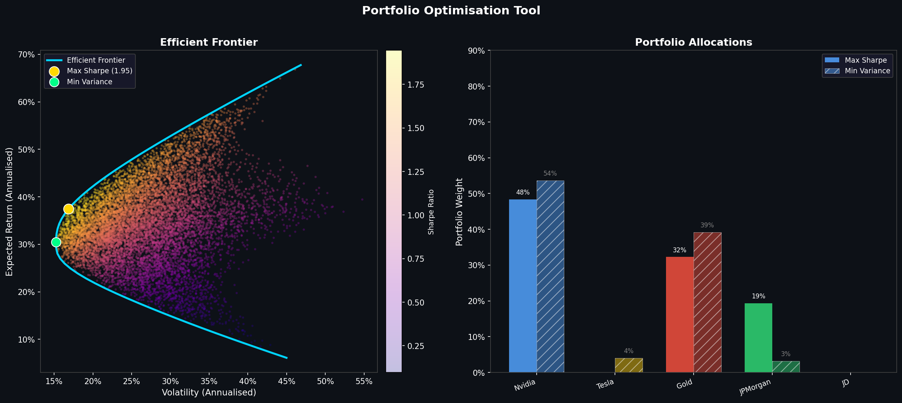

# portfolio-optimisation-tool
# Portfolio Optimisation Tool

A Python tool that identifies the optimal capital allocation across a basket of assets using mean-variance optimisation and Monte Carlo simulation.



---

## What It Does

- Pulls 3 years of daily price data for any set of assets via yfinance
- Calculates expected annual returns and a covariance matrix for the asset universe
- Runs a Monte Carlo simulation generating 10,000 random portfolios
- Traces the efficient frontier using constrained optimisation
- Identifies two optimal portfolios:
  - **Maximum Sharpe Ratio Portfolio**: highest return per unit of risk
  - **Minimum Variance Portfolio**: lowest achievable portfolio volatility
- Outputs a two-panel chart showing the efficient frontier and asset allocations

---

## Key Concepts

**Efficient Frontier**
The set of portfolios that maximise return for a given level of risk. Any portfolio below the frontier is suboptimal.

**Sharpe Ratio**
Measures excess return above the risk-free rate per unit of volatility. A higher Sharpe ratio means better risk-adjusted performance.

**Covariance Matrix**
Captures how assets move relative to each other. Assets with low or negative correlation reduce overall portfolio volatility when held together, which is the mathematical basis of diversification.

**Mean-Variance Optimisation**
Developed by Harry Markowitz (1952). Finds the portfolio weights that minimise variance for a target return, or maximise the Sharpe ratio across the full opportunity set.

---

## How to Run

**Install dependencies**

```
pip install numpy pandas scipy matplotlib yfinance
```

**Run the script**

```
python portfolio_optimisation.py
```

The script saves the output chart as `portfolio_optimisation.png` in the same directory.

---

## Changing the Assets

Open `portfolio_optimisation.py` and update these two lines in Section 1:

```python
TICKERS = ["NVDA", "TSLA", "GLD", "JPM", "JD"]
returns.columns = ["Nvidia", "Tesla", "Gold", "JPMorgan", "JD"]
```

Replace the tickers with any valid Yahoo Finance symbols. Both lists must match in order and length. Tickers can be looked up at finance.yahoo.com.

---

## Example Output

Running on Nvidia, Tesla, Gold, JPMorgan and JD:

| Portfolio | Return | Volatility | Sharpe |
|---|---|---|---|
| Max Sharpe | ~37% | ~15% | 1.95 |
| Min Variance | ~30% | ~14% | 1.64 |

Max Sharpe allocation: 48% Nvidia, 32% Gold, 19% JPMorgan, 6% Tesla, 3% JD

---

## Dependencies

- numpy
- pandas
- scipy
- matplotlib
- yfinance

---

## Author

Sam Sousa | University of Liverpool
